# 강원 문화관광 웹 애플리케이션

## 1. 프로젝트 개요

강원 문화관광 웹 애플리케이션은 강원도의 다양한 관광지, 문화, 여행 정보를 사용자에게 제공하기 위한 웹 서비스입니다.  
사용자가 강원도의 관광지와 문화 정보를 쉽고 빠르게 탐색하고 여행 계획을 세울 수 있도록 직관적인 UI와 관광 정보 제공 기능을 중심으로 개발되었습니다.

---

## 2. Project Architecture (프로젝트 구조)

본 프로젝트는 **Spring Boot를 중심으로 프런트엔드와 백엔드가 통합된 풀스택 웹 애플리케이션** 구조로 개발되었습니다.

- **Backend:** Spring Boot 3.5 (Java 21)를 기반으로 API 설계 및 비즈니스 로직 처리.
- **Frontend:** HTML/css 기반의 화면을 Spring Boot의 정적 자원(Static Resources)으로 통합하여 연결.
- **Database:** PostgreSQL 14를 사용하여 관광 및 문화 데이터를 안정적으로 관리.
- **Deployment:** 통합된 애플리케이션을 Docker 이미지화하여 클라우드 환경에 배포.

### 연결 방식

프런트엔드 빌드 결과물을 스프링 부트의 `src/main/resources/static` 경로에 포함시켜, 별도의 프런트 서버 없이 스프링 부트 서버(Port 8301) 하나로 전체 서비스를 제공합니다.
관광지 정보 조회, 관광 데이터 관리, 사용자 친화적인 인터페이스 제공을 목표로 합니다.

---

# 3. 시연 영상 (Demo Video)

## 3-1 메인 페이지

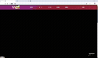

---

## 3-2 회원

### 회원가입

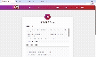

### 로그인

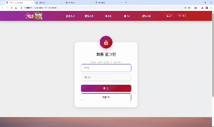

### 로그아웃

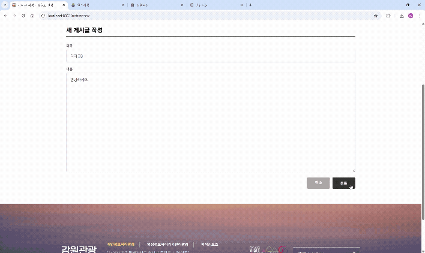

---

## 3-3 알아가기

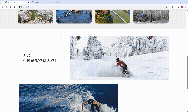

---

## 3-4 즐길거리

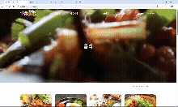

---

## 3-5 먹거리

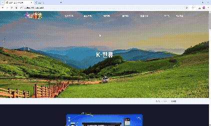

---

## 3-6 축제

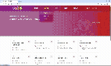

---

## 3-7 알림소식

### 목록

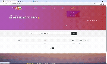

### 글작성


### 수정

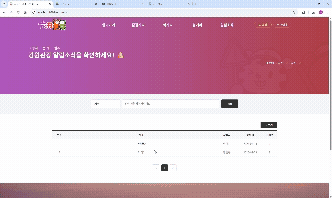

### 삭제

## 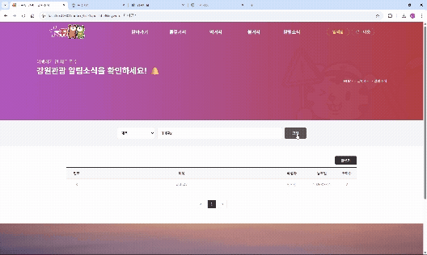

# 4. 팀 정보

팀명 : **Overflow**

| 역할    | 이름   |
| ------- | ------ |
| 팀 리더 | 전보경 |
| 팀원    | 고문식 |
| 팀원    | 최동윤 |

---

# 5. 프로젝트 소개

강원도는 아름다운 자연환경과 다양한 관광 자원을 보유하고 있지만 관광 정보를 한곳에서 편리하게 확인하기 어려운 문제점이 있습니다.

본 프로젝트는 이러한 문제를 해결하기 위해 **강원도 관광 정보를 한눈에 확인할 수 있는 웹 애플리케이션**을 개발했습니다.

사용자는 웹사이트를 통해 다양한 관광지를 탐색하고 관광 정보를 확인할 수 있으며,  
직관적인 UI를 통해 편리하게 관광 정보를 이용할 수 있습니다.

---

# 6. 기술 스택 (Tech Stack)

## 6-1 Frontend

- HTML
- CSS

## 6-2 Backend

- Java
- Spring Boot
- Spring MVC
- Spring Data JPA

## 6-3 Database

- PostgreSQL

## 6-4 DevOps / 협업

- GitHub
- Notion
- Docker

---

# 7. 시스템 아키텍처

```
User
│
▼
Frontend (HTML / CSS / JavaScript)
│
▼
Spring Boot Server
│
▼
PostgreSQL Database
```

---

# 8.프로젝트 링크

### 8-1 프론트엔드 페이지

https://angela860807.github.io

### 8-2 GitHub Repository (백엔드 + 프론트엔드 소스코드)

https://github.com/angela860807/gangwon

### 8-3 프로젝트 산출물 (Notion)

https://www.notion.so/3-310f8eb67df3800a8f2fe53fae6e40be?source=copy_link

---

# 9. Docker 이미지

overflow3/tour-gangwon:1.0

Docker 이미지를 통해 프로젝트 환경을 쉽게 실행할 수 있습니다.

---

# 10. 프로젝트 구조

```
gangwon
│
├─ frontend
│ ├─ html
│ ├─ css
│ └─ js
│
├─ backend
│ ├─ controller
│ ├─ service
│ ├─ repository
│ ├─ entity
│ └─ config
│
└─ database
└─ PostgreSQL
```

---

# 11. 주요 기능

### 11-1 관광지 정보 조회

- 강원도 관광지 목록 확인
- 관광지 상세 정보 확인

### 11-2 관광 정보 제공

- 관광지 위치 및 설명 제공
- 다양한 관광지 정보 제공

### 11-3 사용자 친화적 UI

- 직관적인 UI 구성
- 관광지 정보 탐색 편의성 향상

---

# 12. 실행 방법

## 12-1 프로젝트 클론

git clone https://github.com/angela860807/gangwon.git

---

## 12-2 프로젝트 이동

cd gangwon

---

## 12-3 데이터베이스 설정

PostgreSQL 실행 후 application.properties 설정

spring.datasource.url=jdbc:postgresql://localhost:5432/gangwon
spring.datasource.username=postgres
spring.datasource.password="1004"

---

## 12-4️ Spring Boot 실행

./gradlew bootRun

또는 IDE에서 **Application 실행**

---

## 12-5️ 웹 접속

http://localhost:8301

---

# 13. 프로젝트 화면

### 메인 페이지


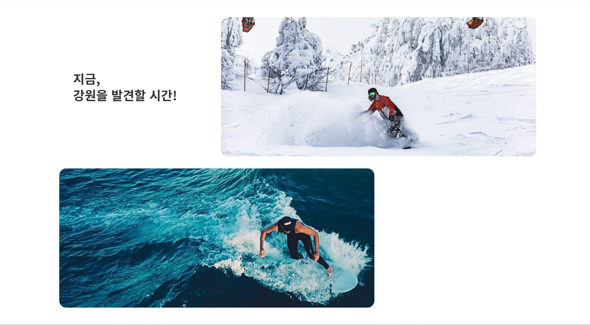

### 푸터

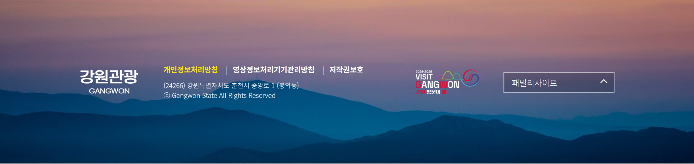

### 알림소식

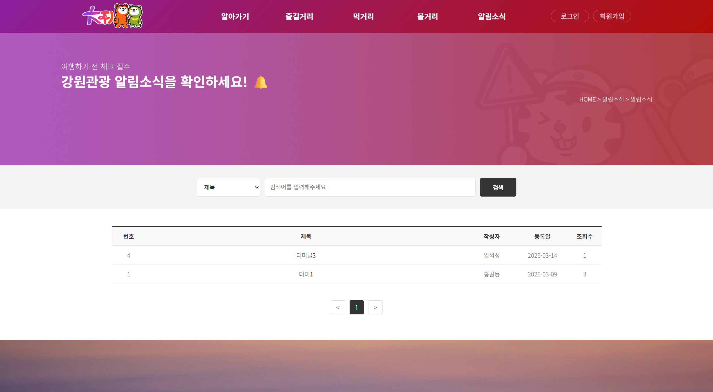

---

# 13-1 기대 효과

- 강원도 관광 정보 접근성 향상
- 관광지 정보 통합 제공
- 사용자 친화적인 관광 웹 서비스 제공
- Spring Boot 기반 웹 애플리케이션 개발 경험

---

# 13-2 향후 개선 사항

- 관광지 리뷰 기능
- 관광지 추천 기능
- 지도 기반 관광지 탐색
- 반응형 웹 지원

---
